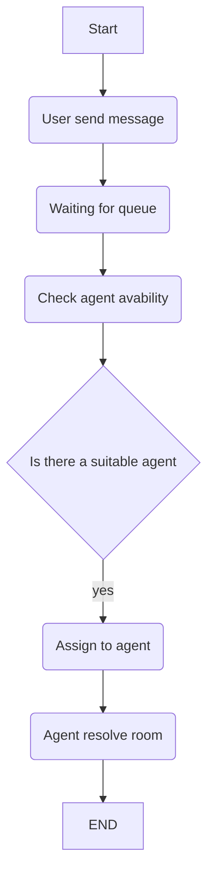
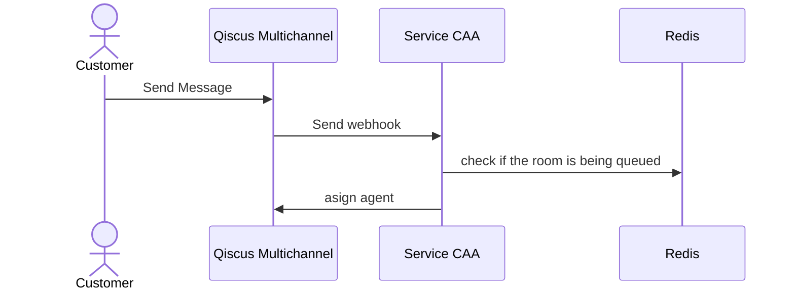

#  Custom Agent Allocations

## Flowchart

```mermaid
graph TD
    Start-->A
    A(User send message) --> B(Waiting for queue)
    B--> C(Check agent avability)
    C--> D{Is there a suitable agent}
    D--> |yes | E(Assign to agent)
    E--> F(Agent resolve room)
    F-->END
```

## Sequence Diagram

```mermaid
sequenceDiagram
    actor customer as Customer

    participant qismo as Qiscus Multichannel
    participant service as Service CAA
    participant db as Redis

    customer->>qismo: Send Message
    qismo->>service: Send webhook
    service->>db: check if the room is being queued

    service->>qismo:asign agent
```